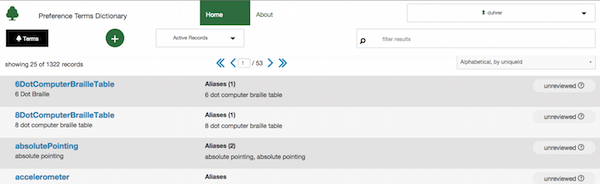
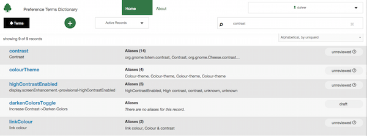
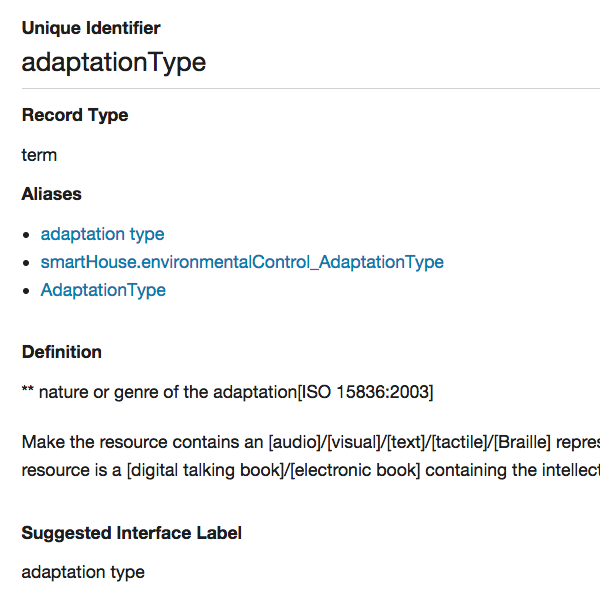
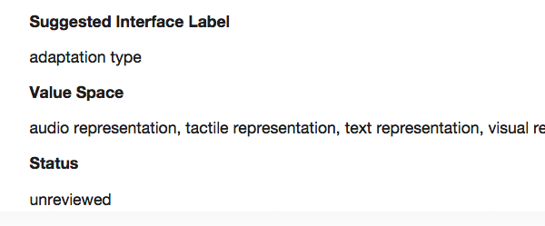
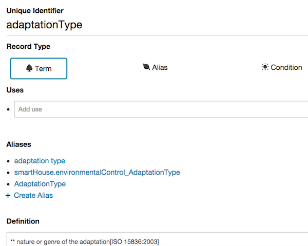
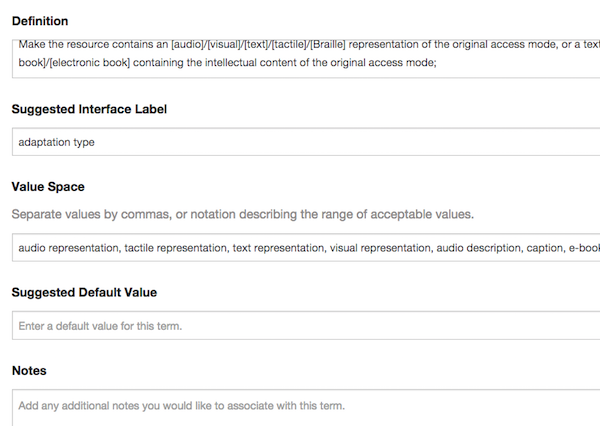
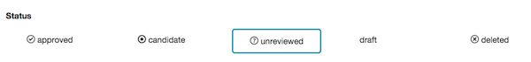
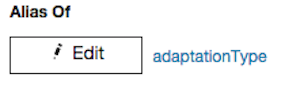
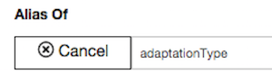
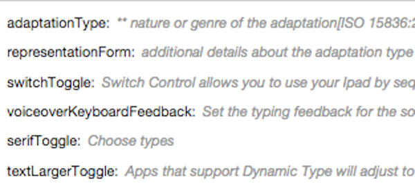

# An Introduction

This documentation covers the basic features of [the Preference Terms Dictionary](https://terms.raisingthefloor.org/).

# The Search

By default, we start on the search page, which presents the current data, and provides the ability to narrow down the results displayed.

Some of these fields will only make sense once we've defined things a bit better.  For now, let's stick to full text searching.

If I tab to the search, then type a search term,  such as "contrast", I should see less records, as in the following screen shot:

# What are these listings?

Each of these listings is a web of closely related settings.

What we see are a list of "common terms", or "terms" for short.  These are the reference form of a single setting, and are not better or worse than any other variation.

Although an application may have settings that directly match the "term", it's also entirely possible that no application will use a "term" itself to refer to its settings.  They may use different words to describe the same setting, or use a different value space.  Most commonly, they may simple use a different keyword specific to their application to identify the "term" when they are storing or retrieving their settings.

For the first case, in which the only difference is in the wording ("volume" vs. "loudness"), we use an "alias" record (more on that in a bit).  For cases in which the setting is represented using different values, we have the concept of a "transform alias", which includes details about how its values are different from the reference "term".  Both can only exist in relation to a "term", which is the central point that connects all other variations on the same setting.

If we know the range of values used for the reference "term" and range of values use for all "transform aliases", we can convert a user's setting from any one variation in the web of related terms to any other.  This is the core value the PTD aims to provide.

# Viewing a "Term" record

So, let's look at the "detail" view for a single "term", which will help us understand other concepts.  Let's go down the list of fields for the term for a few minutes and talk about what each means in this context.

## The "UID" field

First, we have the universal identifier, or "UID" field.  This is required to be completely unique, and cannot currently be changed once it is set.  For common terms, the UID is required to lowerCamelCase conventions without using spaces.  We'll talk more about the "UID" field when we look at an alias.

## The "Record Type" field

Next we have the "record type" field.  In this case it's set to "term".  We'll talk about the full range of options when editing a record (see below).

## The "aliases" field

"Term" records can have one or more "aliases", as described above.  Currently the list is not filtered by status, so you may see deleted or test records here.  This will change shortly.  We'll come back to aliases when we look at one of those records in detail.

## The "definition" field

The "definition" field describes a "term" (and thus a web of related "aliases") with a single clear description.  The "definition" should hold true for the "term" and all "aliases" described.  In other words, the collection of terms and aliases should be interchangeable (even if we have to convert the values used).

## The "suggested interface Label" (or "term label") field

The "UID" field can be thought of as the way in which an application describes a setting when storing the value.  The "suggested interface label" is a human-readable version of this that is more appropriate to display on screen.

## The "value space" field

The "value space" field describes (in free text) how the settings for a "term" or "alias" are represented.

Eventually, we will need to represent one or more paths for moving between value spaces, which will require storing some kind of structured representation as well.

For now, focus on the text description, which we lack for many records.

## The "suggested default" field

Although we don't imply that any setting is better or worse than another, we may optionally wish to indicate what most applications use by default.  The "suggested default" field records this, but for informational purposes only.  In other words, this information may be useful to editors and implementers, but should never be used to change someone's settings.

## The "status" field

We will talk about this more when we talk about editing a record, for now it's enough to know a few simple things.  First, we have a workflow, and the "status" field indicates which step in the workflow a record is at.  Second, users can filter search results by "status", to see (for example) only the records that have been reviewed and flagged as "active".

# Editing records

Anyone with an account (see below) can edit and add records.  If you don't already have any account, create one using the self-sign up form (found in the upper right corner or on the login form).  Once you submit your account details, your account will immediately be created.  Your account cannot be used until it is activated.  To activate your account, you will need to verify your email address using the link sent to you.

Once you have an account and log in, the "details" interface changes to show use the controls for all fields and the full range of options for fields like "status" and "record type".

I will describe these in more detail below.  We also are required to follow rules when entering data, I'll describe a few notable rules as well.

## The "UID" field

There are a few rules that govern the use of "UID" fields:

1.  A "UID" must be completely unique throughout the PTD.
2.  For "term" records, UIDs are required to follow lower camel case conventions.
3.  We cannot edit this field through the web interface once it is set.

In general, you will only edit the "UID" field when adding new records.

## The "record type" field

As discussed above, "terms" are the reference form of the setting, "term" is the record type for these.  "Alias" is the record type for both "aliases" and "alias transforms".  We currently only have "alias" and "term" data to work with.  We will also eventually have support for both the "condition" record type and a "translation" record type.

The "record type" can be changed, but there are restrictions for terms.  If a "term" currently has aliases, you must associate the aliases with another "term" before you can change the record type of the "term".  This is required to prevent aliases from becoming "orphaned".

## The "uses" field

Our "view" example didn't show the uses field, because nothing had been entered.  The "uses" field is used to build a list of applications that use this setting.  Add one application per line, it will be stored as an array.  As there has been a lot of discussion over application-specific and application-unique settings, I thought I would explain how to store these using the "uses" field.

An application-specific setting is an "alias" that only has one "uses" entry.  In other words, it is a variation on the "term" that is unique to this application, but there are other variations available for other applications.

An application-unique setting is a "term" that has only one "uses" entry and no aliases.  In other words, it's only ever conceivable that it would be used by one application.  Some argue that we should not track these, but I am describing how they might be entered here because I feel we should leave it to GPII users and the larger community that supports them to tell us which settings they want to control.

## The "notes" field

The "notes" field that is used to collect information not found anywhere else.  This currently contains extra data from the initial import and notes from various reviewers.  This field is non-canonical, the idea is that we will eventually have structured fields that will reduce the need to use this field.

## The "status" field

Eventually, we will have a review workflow that has a clear progression from step to step.  For now, we have a "status" field which can be changed to move a record to any step in the workflow.  The valid values are:

| Status | Description |
| ------ | ----------- |
| *Approved*   | The record has been completely reviewed and is approved as a stable setting that end users can make use of. |
| *Candidate*  | The record is awaiting final approval. |
| *Unreviewed* | The record has been submitted for review, but has not been approved as a candidate yet. |
| *Draft*      | The record has been created, but has not been submitted for review. |
| *Deleted*    | The record has been flagged as "deleted". |

All records have been imported as "unreviewed" at the moment.  There are also test and nonuseful imported records that have already been flagged as "deleted".  No other statuses are currently used.

# Editing an "Alias" record

Different fields are allowed for different record types, so let's look at an "alias" record for a bit and talk about the differences.  Some fields are simply not allowed, and will disappear when working with this record type.

## The UID field for aliases

The universal ID ("UID") field for an alias is allowed to be more flexible, but should describe the way in which the application(s) that use it refer to the setting.  In short, it should be useful in understanding how the value might be stored, even if it doesn't literally represent the full registry key, .ini file entry, etc. that needs to be represented.

## The "Alias of" field

An alias must be associated with a single term.  The "alias of" field refers to the UID of a single "term".  The "link picker" looks like a link with an "Edit" button next to it.

When you click the "edit" button, the "link picker" provides a text input you can use to search for a "term".

When you enter text in this field, a list of suggestions is presented.

Click (or use your keyboard to select) one of the suggestions to pick the "term" you would like to link to.

# Adding a record

You can add a new record using the "add" icon from the search interface.

If you are editing a "term" and would like to add an "alias" directly, you can use the "Create Alias" link that appears at the bottom of the list of "aliases".  The "add" interface will be displayed with the "aliasOf" field already filled out.

# More information

For the purposes of clarity, a lot of information is left for you to discover when working with real records.  In most cases, the web interface will provide general instructions.  The web interface will also give you clear feedback when what you enter doesn't match the rules.

If something is unclear or you're curious, the PTD web interface was implemented based on the specifications outlined in [the wiki](http://wiki.gpii.net/index.php/Common_Terms_Registry), which contains more detailed information. 